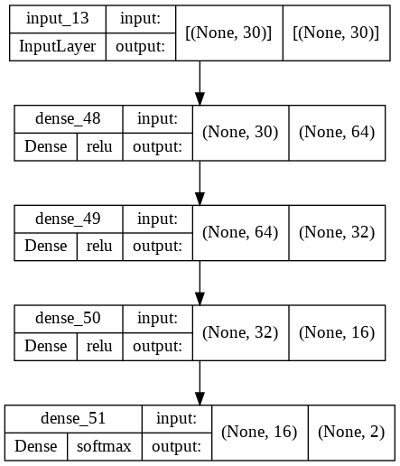
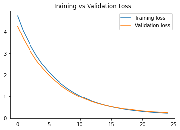
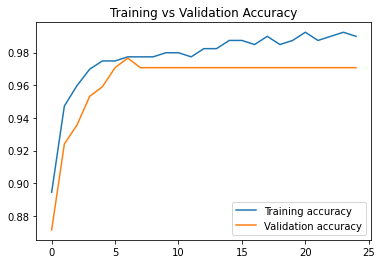

# Breast-Cancer-Wisconsin

## 1. Summary
##### This is Data set to Classify the Benign and Malignant cells in the given data set using the description about the cells in the form of columnar attributes. There are Visualizations and Analysis for Support.
##### This data was donated by researchers of the University of Wisconsin and includes the measurements from digitized images of fine-needle aspirate of a breast mass.

## 2. Code and Resources Used 
##### This project is created using Google Colab as the main IDE.
##### Main Packages:** Pandas, Scikit-learn and TensorFlow Keras.
##### This dataset has been taken from Kaggle.
##### Kaggle link: https://www.kaggle.com/datasets/uciml/breast-cancer-wisconsin-data?resource=download

## 3. Methodology
### 3.1. Data Pipeline
##### The data is first loaded and pre-processed by removing null values and remove unwanted features. Then the data undergoes one hot encoding for labels. Finally, the data split into train size of 70% and test size of 30% respectively.

### 3.2. Model Pipeline
##### Feedforward neural network is used for this classification problem. There are some regulization been added to overcome overfitting. Figure below shows the structure of the model.

##### The model is trained with a batch size of 16 and for 25 epochs. The training accuracy achieved 98% and validation accuracy of 97%. The two figures below show the graph of the training process.

 

## 4. Results
##### Upon evaluating the model with test data, the model obtain the following test results, as shown in figure below.

