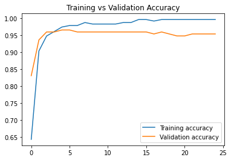
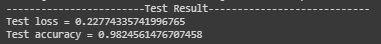

# Breast-Cancer-Wisconsin

## 1. Summary
This is Data set to Classify the Benign and Malignant cells in the given data set using the description of the cells in the form of columnar attributes. There are Visualizations and Analyses for Support.
This data was donated by researchers of the University of Wisconsin and includes the measurements from digitized images of fine-needle aspirate of a breast mass.

## 2. Code and Resources Used
*	This project is created using Google Colab as the main IDE. 
*	Main Packages: Pandas, Scikit-learn and TensorFlow Keras. 
*	This dataset has been taken from Kaggle. 
Kaggle link: https://www.kaggle.com/datasets/uciml/breast-cancer-wisconsin-data?resource=download

## 3. Methodology
### 3.1. Data Pipeline
The data is first loaded and pre-processed by removing null values and remove unwanted features. Then the data undergoes one-hot encoding for labels. The data is split into train-validation-test sets, with a ratio of 60:20:20.

### 3.2. Model Pipeline
Feedforward neural network is used for this classification problem. There are some regularizations have been added to overcome overfitting. The figure below shows the structure of the model.

The model is trained with a batch size of 16 and for 25 epochs. The training accuracy achieved 99% and the validation accuracy of 95%. The two figures below show the graph of the training process.

 

## 4. Results
Upon evaluating the model with test data, the model obtains the following test results, as shown in the figure below.

